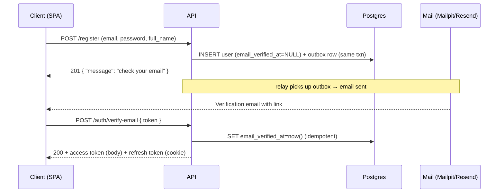
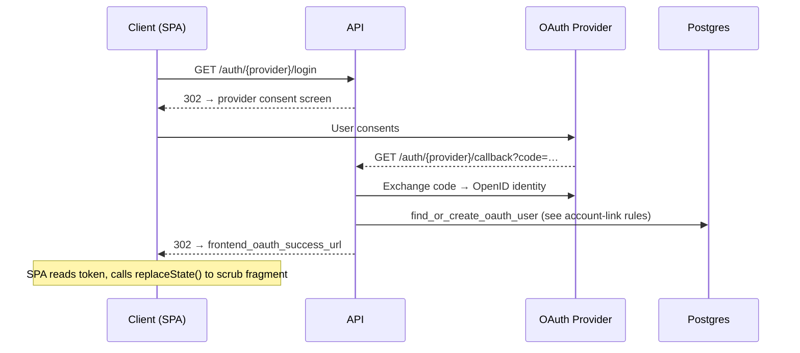

# Authentication

> **Covers:** [S1](../criteria/grading-criteria.md#security-15-points) (password hashing) · [S2](../criteria/grading-criteria.md#security-15-points) (input validation + rate limiting) · [S3](../criteria/grading-criteria.md#security-15-points) (authorization) · [SC3](../criteria/grading-criteria.md#scalability-design-15-points) (stateless horizontal scaling)

---

## Overview

Hefest issues a short-lived **access token** (stateless JWT) plus a long-lived **rotating refresh token** (opaque, stored hashed in Postgres). Users authenticate with email + password, Sign in with Google, or Sign in with Microsoft (Entra ID — for `edu.mon.bg` government education accounts). In every case the backend mints **its own** token pair; the provider's tokens are never used to call the Hefest API.

**Email verification gates local accounts.** A local registration is inactive until the email is confirmed. An OAuth sign-in is proof of email ownership, so SSO users are active immediately.

**OAuth providers are individually toggleable.** A provider is enabled only when its config is present; running with no OAuth apps set up is the default. Email/password auth always works. `GET /auth/providers` tells the frontend which login options to render, marking unconfigured providers as `available: false` rather than hiding them.

Auth lives inside the `api` process. Token validation is stateless in-process JWT decoding on every request; token issuance is low-frequency. The API scales horizontally by running more replicas.

---

## Token model

| Token | Type | Lifetime | Storage |
|---|---|---|---|
| Access | JWT HS256 (`HEFEST_JWT_SECRET`) | **15 min** | None (stateless) — claims: `sub`, `role`, `iss="hefest"`, `aud="hefest-api"`, `iat`, `exp`, `type="access"` |
| Refresh | Opaque random (`secrets.token_urlsafe(32)`) | **14 days** | Postgres `refresh_tokens`, **SHA-256 hash only** — single-use, rotated on every refresh |
| Email-verify | JWT HS256 | **24 h** | None (stateless) — claims: `sub`, `aud="hefest-verify"`, `exp`, `type="email_verify"` — embedded in the verification link |

**Why opaque + SHA-256 for refresh (not JWT, not bcrypt):** refresh tokens are high-entropy random strings, so a fast SHA-256 is safe at rest and allows an indexed lookup by hash. bcrypt would force a table scan. The opaque token carries no claims and is meaningless if leaked from the DB.

**`aud` claim:** access tokens use `aud="hefest-api"`; the verify-email JWT uses `aud="hefest-verify"` so a verification link can never be replayed as an API token.

**HS256 vs RS256:** HS256 is correct here because auth and the API are colocated. If a separate service ever needs to verify tokens without being able to forge them, migrate to RS256/ES256 with a published public key (algorithm is config, not a code rewrite).

### Token rotation and reuse detection

Every `POST /auth/refresh` atomically invalidates the presented token and issues a fresh pair.

If an already-revoked token is presented to `/auth/refresh`, that token was stolen and replayed after the legitimate client already rotated it. The whole family is revoked and a `401 token_reuse_detected` is returned, forcing a fresh login everywhere (RFC 6819).

---

## Flows

### Local sign-up and email verification

!!! note "Dev shortcut"
    When `HEFEST_ENV=dev`, `POST /register` also returns a `verify_token` field directly in the response so the flow can be exercised without a running mail server. This field is **never present** in staging or production.

### OAuth sign-in (Google / Microsoft)

The SPA **must** call `window.history.replaceState()` immediately after reading the token from the URL fragment to prevent it leaking via browser history or screen-share.

### Account-linking rules (OAuth email collision)

| Existing user state | Action |
|---|---|
| No user with that email | Create new `student` user (`email_verified_at = now()`) + identity row |
| Verified local user (`email_verified_at IS NOT NULL`) | Auto-link: add an `oauth_identities` row to the existing user |
| Unverified local user (`email_verified_at IS NULL`) | Take over the dormant row — set `email_verified_at = now()`, `password_hash = NULL`, update name; the original registrant never proved ownership, so no access is lost |

---

## Cookie and Bearer transport

**Web (default):** access token in the JSON response body (SPA holds it in memory); refresh token in a `Secure; HttpOnly; SameSite=Strict; Path=/auth` cookie — not JS-readable, so XSS cannot exfiltrate it.

**Mobile (future):** the refresh endpoint already reads the token from **cookie or body**; a future mobile client can pass `X-Auth-Transport: bearer` on login to receive the refresh token in the body instead.

---

## Configuration reference

All variables use the `HEFEST_` prefix. Secrets live only in `.env` (gitignored) and are never logged.

### Core JWT and cookies

| Env var | Required? | Default | Purpose |
|---|---|---|---|
| `HEFEST_JWT_SECRET` | **yes (prod)** | `change-me-in-production` | HS256 signing key for access and verify JWTs |
| `HEFEST_JWT_ALGORITHM` | no | `HS256` | Signing algorithm; switch point for RS256 path |
| `HEFEST_JWT_AUDIENCE` | no | `hefest-api` | Validated `aud` on every access token |
| `HEFEST_JWT_EXPIRE_MINUTES` | no | `15` | Access-token lifetime in minutes |
| `HEFEST_REFRESH_TOKEN_EXPIRE_DAYS` | no | `14` | Refresh-token lifetime in days |
| `HEFEST_EMAIL_VERIFY_EXPIRE_HOURS` | no | `24` | Verification-link lifetime in hours |
| `HEFEST_REFRESH_COOKIE_NAME` | no | `hefest_refresh` | Name of the httpOnly refresh cookie |
| `HEFEST_REFRESH_COOKIE_SECURE` | no | `true` | Set `false` only for local http dev |

### CORS and OAuth redirect

| Env var | Required? | Default | Purpose |
|---|---|---|---|
| `HEFEST_CORS_ORIGINS` | web SPA | `[]` | Allowed browser origins (credentials mode) |
| `HEFEST_FRONTEND_OAUTH_SUCCESS_URL` | OAuth only | `""` | 302 target after a successful OAuth login |

### Google OAuth (all-or-nothing group)

Setting any one of these without the others leaves Google **disabled**. Leave the group blank to run without Google.

| Env var | Purpose |
|---|---|
| `HEFEST_GOOGLE_CLIENT_ID` | Google OAuth client ID — **enables Google** when all three are set |
| `HEFEST_GOOGLE_CLIENT_SECRET` | Google OAuth client secret |
| `HEFEST_GOOGLE_REDIRECT_URI` | Must exactly match the Google console (trailing slash matters) |

### Microsoft / Entra OAuth (all-or-nothing group)

Restricts sign-in to the `edu.mon.bg` Entra tenant. Leave the group blank to run without Microsoft.

| Env var | Purpose |
|---|---|
| `HEFEST_MICROSOFT_CLIENT_ID` | Entra app client ID — **enables Microsoft** when all four are set |
| `HEFEST_MICROSOFT_CLIENT_SECRET` | Entra app client secret |
| `HEFEST_MICROSOFT_TENANT` | `edu.mon.bg` Entra tenant ID |
| `HEFEST_MICROSOFT_REDIRECT_URI` | Must exactly match the Azure console |

!!! tip "Running without OAuth"
    Leave both OAuth groups blank. Local password auth is always on. `GET /auth/providers` returns both providers with `available: false` so the frontend can render them as greyed-out buttons.

---

## Security properties

| Criterion | What the design does |
|---|---|
| **S1** — password hashing | `bcrypt` cost factor 12; `password_hash` nullable for OAuth-only users; minimum password length ≥ 12 |
| **S2** — input validation | All auth inputs validated via Pydantic v2; rate limiting on `/login`, `/register`, `/auth/refresh` (see [Operations](operations.md#rate-limiting)) |
| **S3** — authorization | `get_current_user` + `require_role` on every protected route; 15-min access tokens with validated `aud`; refresh tokens revocable individually or all-at-once; unverified accounts cannot authenticate |
| **SC3** — horizontal scaling | Access-token validation is stateless in-process JWT decoding; refresh state is in shared Postgres reachable by all replicas |
| **Browser security** | Refresh token in `HttpOnly; Secure; SameSite=Strict` cookie (XSS-proof); access token held in memory; CORS locked to explicit `HEFEST_CORS_ORIGINS` |
| **Secrets** | `JWT_SECRET`, OAuth client secrets live only in `.env` (gitignored); never logged |
