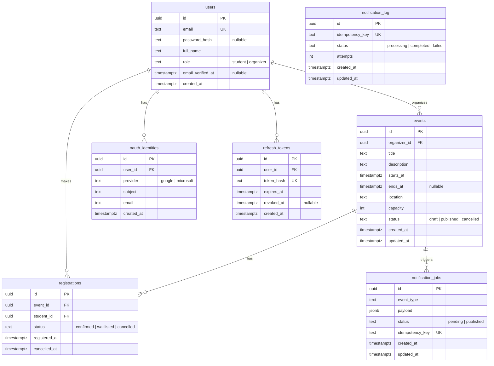

# Data Model

> **Covers:** [B2](../criteria/grading-criteria.md#backend-30-points) — relational schema, migrations, uniqueness constraints, and partial indexes.

---

## Entity diagram



---

## Key constraints

```sql
-- One active registration per student per event.
-- 'cancelled' rows are excluded so a student may re-register after cancelling.
CREATE UNIQUE INDEX uq_one_active_registration_per_student
    ON registrations (event_id, student_id)
    WHERE status IN ('confirmed', 'waitlisted');

-- Idempotency: a job type can only be delivered once per registration.
-- Enforced at the DB level as a backstop behind the application check.
ALTER TABLE notification_log
    ADD CONSTRAINT uq_notification_log_key UNIQUE (idempotency_key);

-- OAuth identities: one provider-subject pair per user.
-- A user may link multiple OAuth providers; provider + subject combo uniquely identifies a user across that provider.
CREATE UNIQUE INDEX uq_oauth_provider_subject
    ON oauth_identities (provider, subject);

-- Refresh tokens: token hash stored (not the token itself; hashed like passwords).
CREATE UNIQUE INDEX uq_refresh_token_hash
    ON refresh_tokens (token_hash);
```

These are declared natively in Tortoise ORM model `Meta` using `UniqueConstraint(condition=...)` (available since Tortoise ORM v1.1.4), so `makemigrations` tracks them automatically without `RunSQL`.

---

## Indexes

```sql
-- Fast published event listing (students)
CREATE INDEX idx_events_published ON events (status) WHERE status = 'published';

-- Fast organizer event lookup
CREATE INDEX idx_events_organizer ON events (organizer_id);

-- Confirmed seat count (used in every registration transaction)
CREATE INDEX idx_registrations_event_status ON registrations (event_id, status);

-- FIFO waitlist ordering for promotion and position queries
CREATE INDEX idx_registrations_waitlist_fifo
    ON registrations (event_id, registered_at)
    WHERE status = 'waitlisted';

-- Student's own registrations (/registrations/me)
CREATE INDEX idx_registrations_student ON registrations (student_id);

-- Relay polling: only scan pending rows, not the full historical table
CREATE INDEX idx_jobs_pending ON notification_jobs (id) WHERE status = 'pending';

-- Stale-delivery reclaim: find stuck 'processing' deliveries
CREATE INDEX idx_log_processing ON notification_log (idempotency_key) WHERE status = 'processing';
```

Partial indexes are declared using `PartialIndex(condition={...})` in model `Meta.indexes`, which Tortoise ORM v1.1.4+ emits as `CREATE INDEX ... WHERE` automatically.

---

## Design decisions

| Decision | Choice | Reason |
|---|---|---|
| `ends_at` | Nullable | Supports single-datetime events; can be tightened later without a breaking change |
| Re-register after cancelling | Allowed | The partial unique index already permits it; a hard block would add needless code |
| Organizer account creation | Seed script (documented in README) | No public org-creation endpoint, avoiding a privilege-escalation surface |
| `password_hash` in users | Nullable | OAuth-only users may not have a password; email+password login checks this field |
| `email_verified_at` in users | Nullable timestamp | NULL = account inactive/unverified; populated on email verification; enables email verification step |
| `oauth_identities` table | Separate relation | Links external OAuth provider identities to users; supports account linking and multi-provider SSO |
| `refresh_tokens` table | Separate relation | Token rotation: old tokens stored in DB; enables logout-all and detects token replay attacks (reuse_detected error) |
