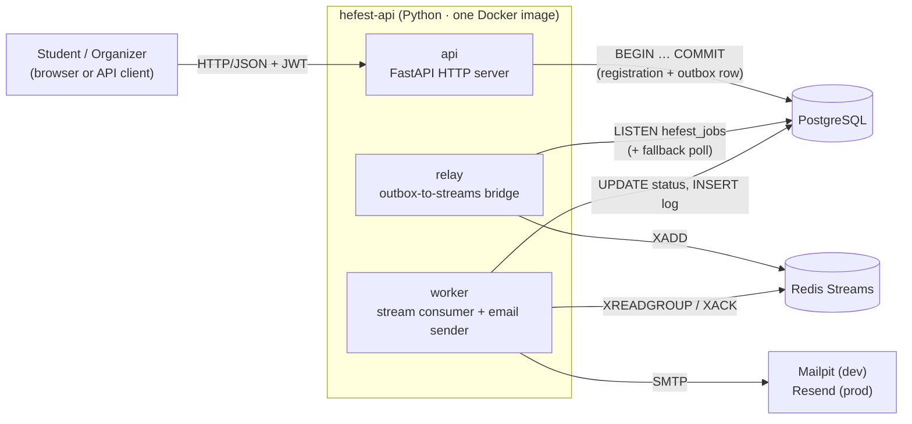

# System Overview

**Project:** School Events & Notification Center — AIBEST 2026 Burgas
**Status:** Approved
**Stack:** Python 3.12 · FastAPI · Tortoise ORM · PostgreSQL 16 · Redis 7

---

## What we are building

A backend for a school event management system. The system has two user roles: **students**, who browse and register for events, and **organizers**, who create and publish events and manage registrations.

The backend has two core responsibilities:

1. **A REST API** that handles authentication, event management, and registrations — and must return fast, even when a student registers for a fully-booked event and needs to be waitlisted.
2. **An async notification pipeline** that sends emails *after* the API has responded, without blocking the HTTP request. This is the event-driven part of the system.

---

## System topology

The backend runs as **three separate processes** that share one PostgreSQL database and communicate through Redis Streams. Each process has a single, clear responsibility.



| Process | Repo | Responsibility |
|---|---|---|
| `api` | `hefest-api` | Handle HTTP requests, enforce auth/roles, run business transactions |
| `relay` | `hefest-api` | Bridge: read pending outbox rows → publish to Redis Streams |
| `worker` | `hefest-api` | Consume Redis Streams → send email → write delivery log |

All three processes live in the same `hefest-api` repo and share the same Docker image (different entrypoints). They are composed together via `docker-compose`.

### Why three processes, not two?

The relay decouples outbox-polling from email-sending. The API writes to Postgres; the relay bridges Postgres to Redis; the worker consumes Redis. This lets each process be scaled and replaced independently. The worker stays simple: it only needs to read from Redis and send email — it never touches the outbox table.

---

## Technology stack

| Concern | Tool | Reason |
|---|---|---|
| HTTP framework | FastAPI | Async, fast to build, native Pydantic integration |
| ORM | Tortoise ORM | Async-native, fits FastAPI's async model |
| Migrations | Tortoise ORM built-in (`tortoise` CLI) | `makemigrations` / `migrate` / `downgrade` built in since v1.0; Aerich is no longer maintained |
| Validation | Pydantic v2 | Request/response schemas, type-safe DTOs |
| Auth | JWT (python-jose + passlib bcrypt) + fastapi-sso | access-stateless · refresh-stateful · email-verified |
| Database | PostgreSQL 16 | Relational, transactional, supports `FOR UPDATE` and partial indexes |
| Queue | Redis 7 (Streams) | Low-latency async delivery; consumer groups for multi-worker load sharing |
| Worker email | redis-py · asyncpg · aiosmtplib | Redis consumer, Postgres writes, async SMTP |
| Dev email | Mailpit | Captures outbound email locally without a real SMTP account |
| Prod email | Resend | Transactional email API; worker switches provider via `HEFEST_SMTP_*` env vars |
| Containers | Docker + docker-compose | Single-command local setup |
| Package manager | uv | Fast Python dependency resolution and virtual environment management |
| Type checker | ty | Fast static type checking across the entire Python codebase |
| Linter / formatter | Ruff | Formatting and linting (replaces black, isort, flake8) |

---

## Naming conventions

**Hefest** is the codename for this project, used as a consistent prefix across every named artifact — repositories, services, containers, environment variables, and infrastructure resources. This makes it immediately clear what belongs to this project and avoids collisions in shared environments.

| Artifact | Pattern | Examples |
|---|---|---|
| Repositories | `hefest-<role>` | `hefest-api`, `hefest-docs` |
| Docker images | `hefest-<role>` | `hefest-api` |
| Compose services | `hefest-<role>` | `hefest-api`, `hefest-relay`, `hefest-worker`, `hefest-db`, `hefest-redis`, `hefest-mail` |
| Container names | `hefest-<role>` | same as compose service names |
| Database name | `hefest_db` | — |
| Redis stream | `hefest:notifications` | — |
| Redis key prefix | `hefest:` | `hefest:some-key` |
| Environment variables | `HEFEST_<NAME>` | `HEFEST_DB_URL`, `HEFEST_JWT_SECRET` |
| Python package | `hefest` | `from hefest.models import Event` |
| JWT issuer claim | `hefest` | `{"iss": "hefest", ...}` |

---

## Repository structure

```
hefest-api/          (Python)
├── hefest/
│   ├── main.py          — FastAPI application entrypoint
│   ├── config.py        — settings (env vars via pydantic-settings)
│   ├── models/          — Tortoise ORM models
│   ├── schemas/         — Pydantic request/response schemas
│   ├── routers/         — one file per resource (auth, events, registrations, users)
│   ├── services/        — business logic (registration, promotion, outbox)
│   └── worker/
│       ├── relay.py     — outbox-to-Redis relay (separate process entrypoint)
│       ├── consumer.py  — Redis Streams XREADGROUP loop (separate process entrypoint)
│       └── mailer.py    — email delivery (Mailpit dev / Resend prod)
├── migrations/          — Tortoise ORM migration files
├── tests/
└── Dockerfile
```
