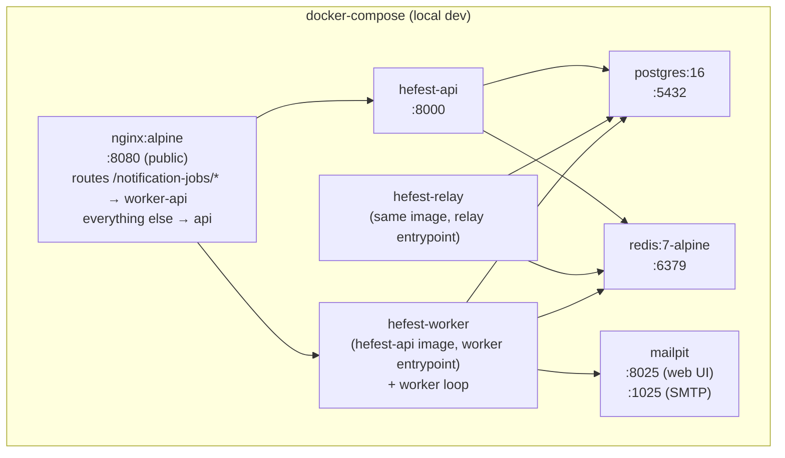

# Operations

Covers rate limiting, deployment, scalability, and architecture decisions.

---

## Rate limiting

> **Covers:** [S2](../criteria/grading-criteria.md#security-15-points) — protects `/login` and `/register` against brute-force and account-creation spam; uses Redis already in the stack.

### Strategy: sliding window with Redis sorted sets

A sliding window is more accurate than a fixed window. It counts requests within the last *N* seconds relative to *now*, so there is no burst problem at window boundaries.

Each request adds a timestamped entry to a Redis sorted set keyed by endpoint and identifier. Entries older than the window are pruned on every check. The operation is atomic via a Redis pipeline:

```python
import time
import redis

def check_rate_limit(r: redis.Redis, key: str, limit: int, window_seconds: int) -> tuple[bool, int]:
    """Returns (is_limited, retry_after_seconds)."""
    now = time.time()
    window_start = now - window_seconds

    pipe = r.pipeline()
    pipe.zremrangebyscore(key, 0, window_start)   # drop entries outside window
    pipe.zadd(key, {str(now): now})               # record this request
    pipe.zcard(key)                               # count requests in window
    pipe.expire(key, window_seconds)              # auto-cleanup idle keys
    _, _, count, _ = pipe.execute()

    if count > limit:
        oldest = float(r.zrange(key, 0, 0, withscores=True)[0][1])
        retry_after = int(window_seconds - (now - oldest)) + 1
        return True, retry_after

    return False, 0
```

**Redis key pattern:** `hefest:ratelimit:{endpoint_tag}:{identifier}`

### Limits per endpoint

| Endpoint | Identifier | Limit | Window | Reason |
|---|---|---|---|---|
| `POST /login` | IP address | 10 requests | 60 s | Brute-force credential guessing |
| `POST /register` | IP address | 5 requests | 3600 s | Account creation spam |
| `POST /events/{id}/registrations` | User ID (from JWT) | 30 requests | 60 s | Registration spam across events |

Global fallback (all routes): 200 requests / 60 s per IP.

### HTTP response

```http
HTTP/1.1 429 Too Many Requests
Retry-After: 42
Content-Type: application/json

{
    "detail": "Too many requests. Please retry after 42 seconds.",
    "code": "rate_limit_exceeded"
}
```

Rate limiting is implemented as a **FastAPI middleware** so it applies before any route handler runs. The middleware extracts the identifier (IP from `X-Forwarded-For` or `request.client.host`; user ID from the JWT if present), runs the Redis pipeline check, and returns `429` immediately if limited.

!!! note "IP extraction behind nginx"
    In the docker-compose setup, nginx sits in front of the API. Configure nginx to pass `X-Forwarded-For` and trust only the nginx container's IP in FastAPI (`--proxy-headers --forwarded-allow-ips`). Without this, all requests appear to come from the nginx container IP and rate limiting by IP breaks.

---

## Deployment

### Local development (docker-compose)

`docker-compose up` starts all services. Migrations run automatically on API startup via an entrypoint script.



### Production path

Production deployment targets Kubernetes via a minimal Helm chart. The same Docker images are used; configuration is injected via `values.yaml`. Managed Postgres (e.g., RDS, CloudSQL) and managed Redis (e.g., ElastiCache) replace the in-compose containers.

Scaling levers available by design:

- **API**: stateless — scale horizontally by increasing replica count
- **Worker**: Redis Streams consumer groups distribute messages across multiple worker replicas automatically
- **Relay**: single instance is sufficient; if relay throughput becomes a bottleneck, partition by `event_id` range across multiple relay instances

---

## Scalability notes

> **Covers:** [SC1](../criteria/grading-criteria.md#scalability-design-15-points) · [SC2](../criteria/grading-criteria.md#scalability-design-15-points) · [SC3](../criteria/grading-criteria.md#scalability-design-15-points)

The current design was intentionally kept minimal (Postgres outbox + Redis Streams rather than a dedicated message broker like RabbitMQ or Kafka). This is sufficient for school-event scale and keeps the demo simple.

| Concern | Current approach | Scaling path |
|---|---|---|
| Queue latency | LISTEN/NOTIFY push + outbox fallback poll (5 s) | Broker-grade latency, no broker; partition relay by `event_id` if a single LISTEN connection saturates |
| Worker parallelism | Single worker process | Redis consumer groups → add worker replicas |
| Read throughput | Postgres with covering indexes | Add read replicas; cache static event metadata (not counts) |
| Registration hotspot | Row-level lock on event | Advisory lock per event_id for even lower contention at scale |
| Notifications | At-least-once SMTP | Switch to Resend (already in production stack) for higher deliverability and send-rate limits |

!!! warning "Do not cache registration counts"
    The confirmed seat count is used in the no-overbooking transaction and must always be read from Postgres under a lock. Caching it would silently break the overbooking guarantee.

---

## Architecture decisions

Decisions made during the brainstorming session on 2026-06-16. Status: **Approved**.

| # | Decision | Resolution |
|---|---|---|
| 1 | `ends_at` requirement | **Nullable** — supports single-datetime events; can be tightened later without a breaking change. |
| 2 | Re-register after cancelling | **Allowed** — the partial unique index already permits it; a hard block would add needless code. |
| 3 | Organizer account creation | **Seed script** (documented in README). No public org-creation endpoint, avoiding a privilege-escalation surface. |
| 4 | Student cancellation window | **Allowed until `starts_at`** — a later attempt returns `409 / event_already_started`. |
| 5 | Worker placement | **Same repo as API** — the worker lives in `hefest-api` under `hefest/worker/`, sharing the same Docker image with a different entrypoint. redis-py, asyncpg, and aiosmtplib are added as dependencies of `hefest-api`. No separate repo or image. |
| 6 | Health/readiness endpoints | **Implemented** — `/health` and `/ready`. |
| 7 | Relay: poll vs. push (HEF-16) | **LISTEN/NOTIFY push + fallback poll** — trigger fires `pg_notify` at COMMIT for ~ms latency; long-interval poll preserves at-least-once durability. |

### Stretch feature (only if time permits)

| Feature | Plan |
|---|---|
| `EventCancelled` notifications | A bonus domain event. Mechanism is already settled: one **bulk** job carrying `event_id`; the worker queries the affected registrations and sends one email per user. |
