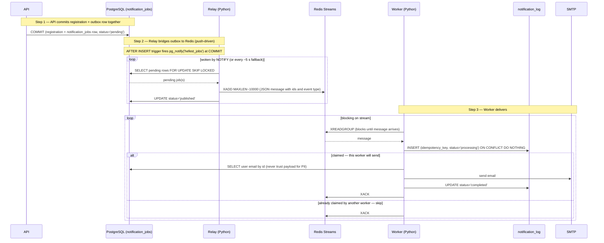
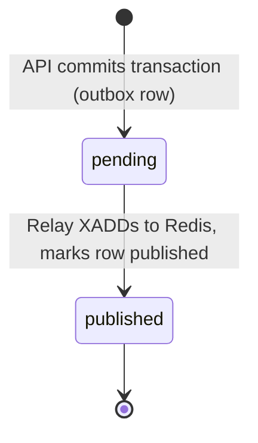
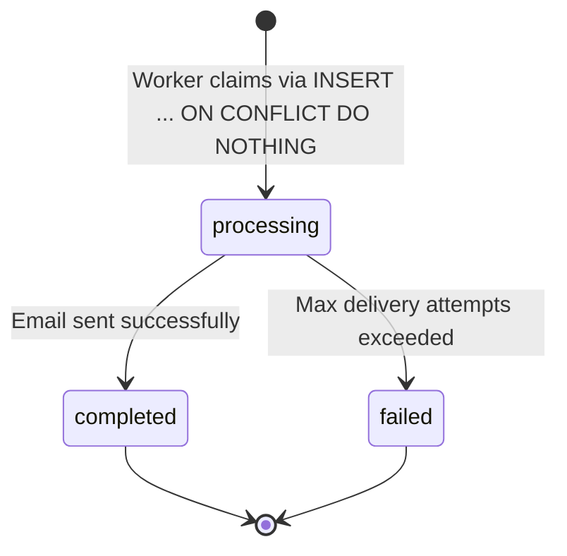

# Notification Pipeline

> **Covers:** [B1](../criteria/grading-criteria.md#backend-30-points) · [A1](../criteria/grading-criteria.md#additional-features-25-points) · [A2](../criteria/grading-criteria.md#additional-features-25-points) · [A3](../criteria/grading-criteria.md#additional-features-25-points) · [A4](../criteria/grading-criteria.md#additional-features-25-points) — async worker process, ≥ 3 domain event types, real email delivery, job state tracking, and idempotency.

---

## The dual-write problem

When a registration is saved, two things must happen: record it in the database and enqueue a notification job. If these go to two different systems (e.g., Postgres + a message queue), a process crash between the two writes can lose the event permanently.

**Solution:** the notification job is a row in the *same* Postgres database, inserted in the *same* transaction as the registration. Both writes succeed or both roll back — atomically. This pattern is called the **transactional outbox**.

---

## Full pipeline flow



!!! note "Stream retention"
    The relay caps the stream with `XADD ... MAXLEN ~ 10000` (approximate trimming) so it cannot grow unbounded over a long-running deployment. Trimmed entries are already delivered and acknowledged; the authoritative record of what was sent lives in `notification_log`, not in the stream.

---

## Why LISTEN/NOTIFY, not a polling loop

> **Covers:** [SC1](../criteria/grading-criteria.md#scalability-design-15-points) — push-based delivery at broker-grade latency without a broker.

The relay is **push-driven** by PostgreSQL `LISTEN/NOTIFY`, not a fixed-interval poll. An `AFTER INSERT` trigger on `notification_jobs` runs `pg_notify('hefest_jobs', '')`; the relay holds a dedicated `LISTEN` connection and drains the moment it is woken.

**Why this matters.** A 1-second poll adds up to a second of latency on every notification and burns one query per tick even when idle. `NOTIFY` collapses that to milliseconds — broker-grade responsiveness — but with **zero added infrastructure**: the signal rides the Postgres connection we already hold.

`NOTIFY` is also **transactional**: it is delivered only on `COMMIT` and deduplicated within the transaction, firing exactly when the outbox row becomes visible. There is no window where the relay could process a row that is about to be rolled back.

**Why the fallback poll stays.** `LISTEN/NOTIFY` is fire-and-forget: a signal emitted while the relay is disconnected is lost. The row is still in Postgres, so a long-interval fallback poll (default every 5 s) guarantees eventual drain and a full catch-up on every reconnect. **Push for latency, poll for durability.** The `idx_jobs_pending` partial index keeps each fallback scan to only the pending rows.

!!! note "Empty payload by design"
    The trigger sends an empty payload — just a wake signal. The relay re-queries `notification_jobs` itself, so the design is immune to the 8000-byte `NOTIFY` payload cap and never puts PII on the channel. A statement-level (not row-level) trigger collapses a bulk insert (e.g. the `EventCancelled` fan-out) to a single wake.

---

## State machines

The two tables track **different concerns** and must not be conflated:

- `notification_jobs` tracks the **outbox handoff**: did the relay get this event onto Redis? Its terminal state is `published`.
- `notification_log` tracks **delivery**: did the worker actually send the email? Its lifecycle is `processing → completed / failed`.

The worker never writes `notification_jobs` — it owns `notification_log` only.

**`notification_jobs` (owned by `api` + `relay`):**



**`notification_log` (owned by `worker`):**



!!! note "Reading job history (`/notification-jobs`)"
    The optional `/notification-jobs` endpoint reports delivery status by `LEFT JOIN`ing `notification_jobs` to `notification_log` on `idempotency_key`: a `published` job with a `completed` log row was delivered; with a `failed` log row it exhausted its retries; with **no** log row it is still in flight.

---

## Domain event types

All three mandatory events below are required for full points.

| Event type | Trigger | Mandatory | Criteria |
|---|---|---|---|
| `RegistrationConfirmed` | Student registered, seat available | Yes | [A1](../criteria/grading-criteria.md#additional-features-25-points) · [F3](../criteria/grading-criteria.md#functionality-40-points) |
| `RegistrationWaitlisted` | Student registered, event full | Yes | [A1](../criteria/grading-criteria.md#additional-features-25-points) · [F3](../criteria/grading-criteria.md#functionality-40-points) |
| `WaitlistPromoted` | Confirmed registration cancelled, next student promoted | Yes | [A1](../criteria/grading-criteria.md#additional-features-25-points) · [F3](../criteria/grading-criteria.md#functionality-40-points) |
| `RegistrationCancelled` | Student cancels own registration | Bonus | [A1](../criteria/grading-criteria.md#additional-features-25-points) · [F3](../criteria/grading-criteria.md#functionality-40-points) |
| `EventCancelled` | Organizer cancels event (bulk job per registered user) | Bonus | [A1](../criteria/grading-criteria.md#additional-features-25-points) · [F2](../criteria/grading-criteria.md#functionality-40-points) |

Example payload (ids only — worker loads names and emails from DB at send time):

```json
{
    "type": "RegistrationConfirmed",
    "event_id": "550e8400-e29b-41d4-a716-446655440000",
    "user_id": "6ba7b810-9dad-11d1-80b4-00c04fd430c8",
    "registration_id": "6ba7b811-9dad-11d1-80b4-00c04fd430c8",
    "occurred_at": "2026-06-16T14:00:00Z"
}
```

---

## Idempotency

> **Covers:** [A4](../criteria/grading-criteria.md#additional-features-25-points) — unique `idempotency_key` + `ON CONFLICT DO NOTHING` prevents duplicate emails on redelivery.

Email delivery is **at-least-once** — the relay may re-publish a message if it crashes between the `XADD` and marking the job `published`. Redis may also redeliver an unacknowledged message via `XAUTOCLAIM`. To prevent duplicate emails, the worker classifies every message by the state of its `notification_log` row before sending:

1. **Claim before sending:** the worker inserts a `notification_log` row with `status='processing'`, `attempts=1` using `ON CONFLICT DO NOTHING` *before* touching SMTP. The worker that inserts the row (1 row affected) proceeds to send.
2. **Row already exists (0 rows affected):** the worker reads the existing row and branches on its status:
    - `completed` → already delivered. `XACK` and stop.
    - `failed` → already gave up (see retry policy). `XACK` and stop.
    - `processing` → a previous worker claimed it but never finished (crash), and `XAUTOCLAIM` redelivered it. This worker resumes delivery under the retry policy.
3. **Worst case:** a crash *after* the SMTP send but *before* the `completed` UPDATE causes one duplicate email on redelivery — tolerable for a school events system; a missed email is worse.

```sql
-- Worker runs this first, before hitting SMTP
INSERT INTO notification_log (idempotency_key, status, attempts, created_at)
VALUES ($registration_id || ':' || $event_type, 'processing', 1, NOW())
ON CONFLICT (idempotency_key) DO NOTHING;
-- 1 row affected → claimed, proceed to send.
-- 0 rows affected → SELECT status, attempts and branch as above.
```

---

## Retry policy

> **Covers:** [A3](../criteria/grading-criteria.md#additional-features-25-points) — `pending / processing / completed / failed` job states; max 3 attempts; failed rows visible via `/notification-jobs`.

Delivery is retried on **transient** failures (SMTP connection error, 4xx greylisting, timeout) up to **3 attempts**, then parked as `failed`.

| Condition | Action |
|---|---|
| Transient send failure, `attempts < 3` | Increment `notification_log.attempts`; do **not** `XACK`. The message stays pending in the stream and `XAUTOCLAIM` (min-idle 5 min) redelivers it to a worker. |
| Transient send failure, `attempts >= 3` | `UPDATE notification_log SET status='failed'`; `XACK` to stop redelivery. |
| Permanent failure (e.g. 550 invalid recipient) | `UPDATE notification_log SET status='failed'` immediately; `XACK`. No retry — it can never succeed. |
| Send success | `UPDATE notification_log SET status='completed'`; `XACK`. |

The 5-minute `XAUTOCLAIM` idle window provides natural spacing between attempts, so no explicit exponential backoff is needed at this scale. A `failed` row stays visible via `/notification-jobs` for manual inspection.
