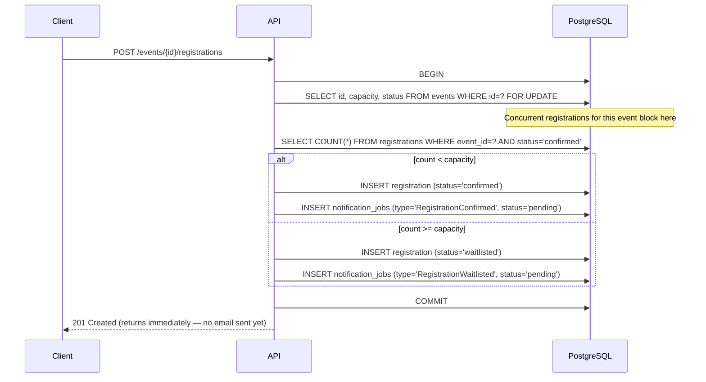
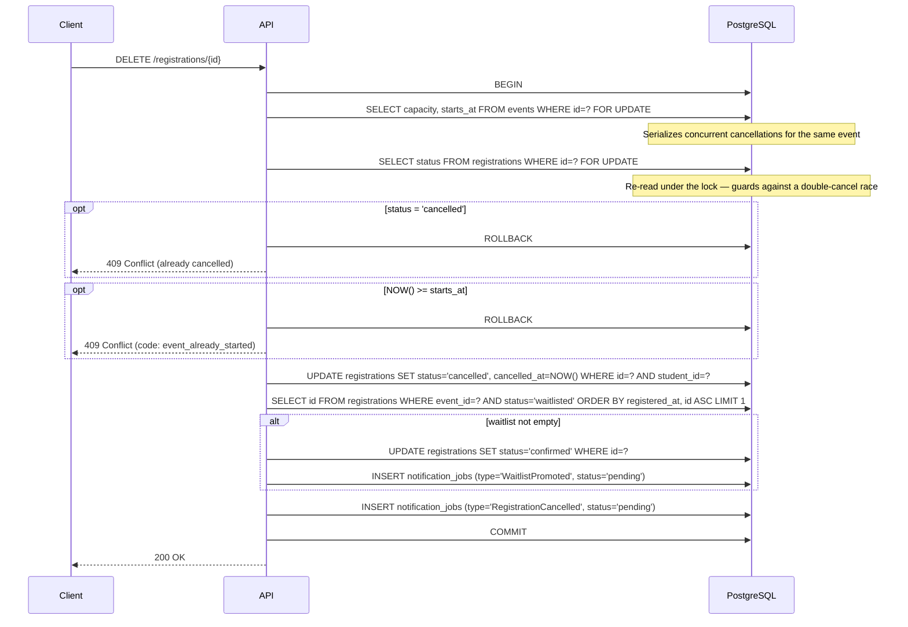

# Business Logic & Transactions

> **Covers:** [F3](../criteria/grading-criteria.md#functionality-40-points) · [CQ3](../criteria/grading-criteria.md#code-quality-10-points) — the no-overbooking and promotion logic; the sequence diagrams and warning box below serve as the required documentation for non-obvious transactional logic.

These two transactions are the core of the system's correctness guarantees.

!!! warning "Tortoise ORM: `select_for_update()` must be inside an explicit transaction"
    `FOR UPDATE` locks rows "until the end of the transaction". Outside an explicit transaction, Tortoise runs in autocommit mode — the lock is acquired and released instantly, silently defeating the overbooking guarantee. Always wrap the lock + count + insert in a single `async with in_transaction() as conn:` block (or `@atomic()` decorator) and pass that connection (`.using_db(conn)`) to every query in the block.

---

## Student registers for an event

> **Covers:** [F3](../criteria/grading-criteria.md#functionality-40-points) (overbooking prevention, CONFIRMED/WAITLISTED outcome) · [A1](../criteria/grading-criteria.md#additional-features-25-points) (`RegistrationConfirmed` / `RegistrationWaitlisted` domain event inserted in same transaction)

The challenge: two students can POST simultaneously. Without serialization, both could read "2 of 3 seats taken" and both get confirmed — creating 4 confirmed rows for a capacity-3 event (overbooking).

The fix: lock the event row at the start of the transaction. Any concurrent registration for the same event blocks at that lock until the first transaction commits.



!!! note "Why lock the event row, not the registrations table?"
    You cannot lock a `COUNT()` — it is a derived value. Locking the single, always-present event row is the standard pattern. The lock is held only for the duration of one count query and one insert (microseconds), so throughput at school-event scale is not affected.

If the unique index fires (student already has an active registration for this event), Postgres raises an error and the transaction rolls back automatically. Return `409 Conflict` to the client.

---

## Student cancels → automatic waitlist promotion

> **Covers:** [F3](../criteria/grading-criteria.md#functionality-40-points) (student cancellation rule + automatic FIFO promotion) · [A1](../criteria/grading-criteria.md#additional-features-25-points) (`WaitlistPromoted` and `RegistrationCancelled` events)

The seat freed by a cancellation must be assigned to the next waitlisted student **in the same transaction**. There must be no moment where the seat appears "free" without an owner.



If the cancelling student was **waitlisted** (not confirmed), no seat is freed and the promotion step is skipped. This is a separate code path with the same transaction structure.

!!! warning "Re-read the registration *after* taking the event lock"
    A naive version reads the registration first and locks the event second. Two concurrent cancellations of the same registration then both observe `confirmed`, serialize on the event lock, and the second acts on its stale snapshot — promoting a second waitlisted student in error. We re-read the registration with `FOR UPDATE` *inside* the lock so the decision uses committed state. See [Challenges #1](challenges.md#1-the-double-cancel-race).

!!! note "Deterministic FIFO needs a tie-breaker"
    Two registrations can share an identical `registered_at` microsecond, and Postgres does not guarantee order on a tie. Every waitlist ordering uses `ORDER BY registered_at, id` so promotion, the organizer waitlist, and the displayed position always agree. See [Challenges #2](challenges.md#2-identical-timestamps-broke-fifo).

!!! note "Cancellation window"
    Students may cancel only **before the event's `starts_at`**. A cancellation attempt at or after `starts_at` is rejected with `409 Conflict` / `event_already_started`.

---

## Waitlist position (read-only)

> **Covers:** [F3](../criteria/grading-criteria.md#functionality-40-points) (waitlist position visible to student in `/registrations/me`) · [F4](../criteria/grading-criteria.md#functionality-40-points) (waitlist size visible to organizer via `/events/{id}` counts) · [SC2](../criteria/grading-criteria.md#scalability-design-15-points) (covered index avoids a sequential scan)

The waitlist position shown to a student in `GET /registrations/me` is computed at read time — no stored integer that can drift under concurrent writes.

An earlier version ran one `COUNT(*)` per waitlisted registration (an N+1), and counted `registered_at < mine`, which assigns the same position to two rows that tie on the timestamp. The shipped version uses a **single** ordered read across all the student's waitlisted events and assigns positions in one in-memory pass, with `id` breaking ties so the number matches promotion order:

```sql
-- One query for all events the student is waitlisted in
SELECT id, event_id
FROM registrations
WHERE event_id = ANY($waitlisted_event_ids)
  AND status   = 'waitlisted'
ORDER BY event_id, registered_at, id;
-- Position = rank within each event_id group, computed in application code.
```

The `idx_registrations_waitlist_fifo` partial index covers this read directly. See [Challenges #4](challenges.md#4-an-n1-in-registrationsme).
