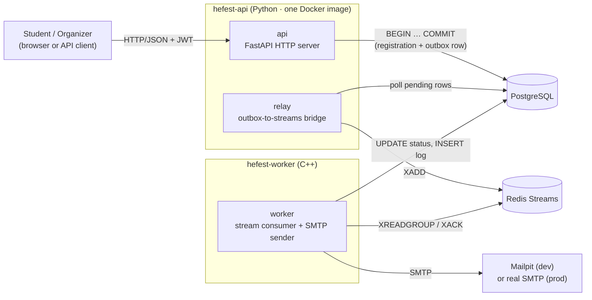
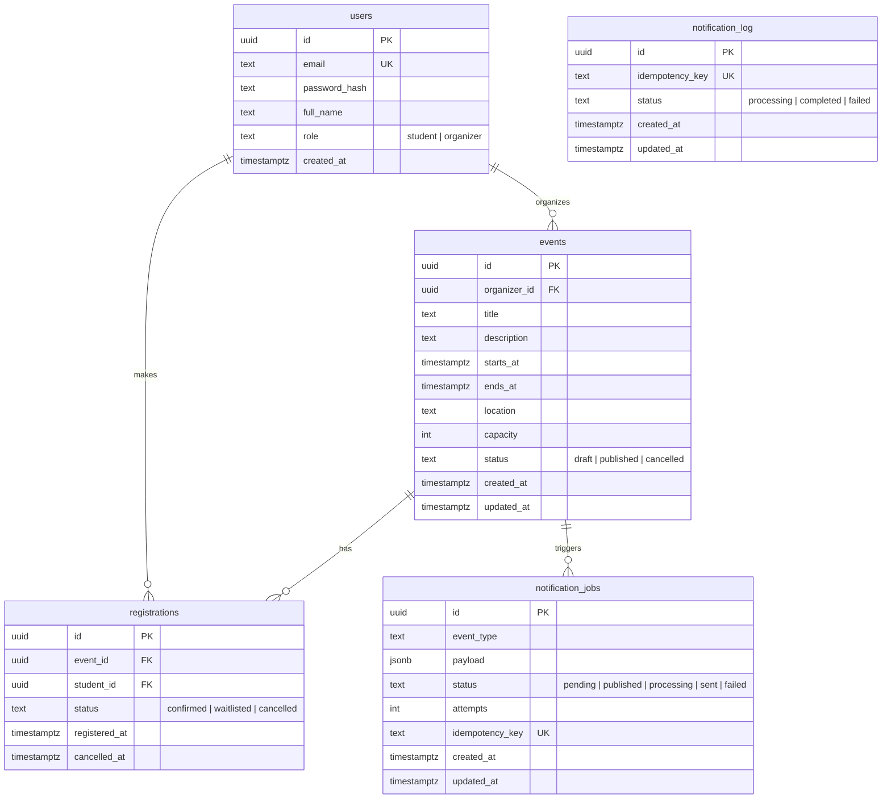
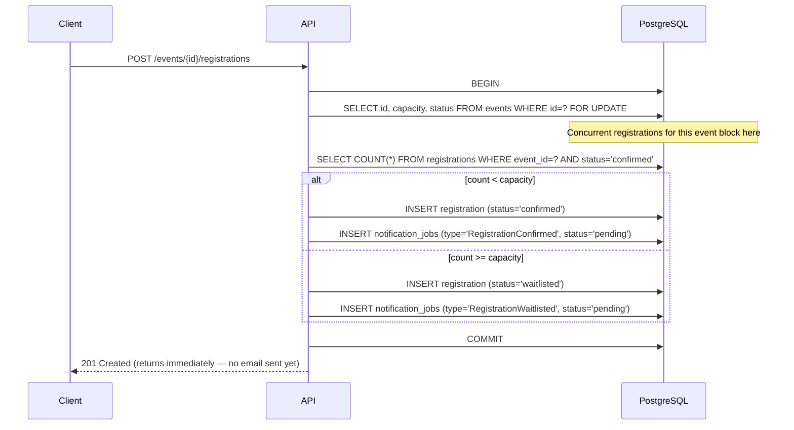
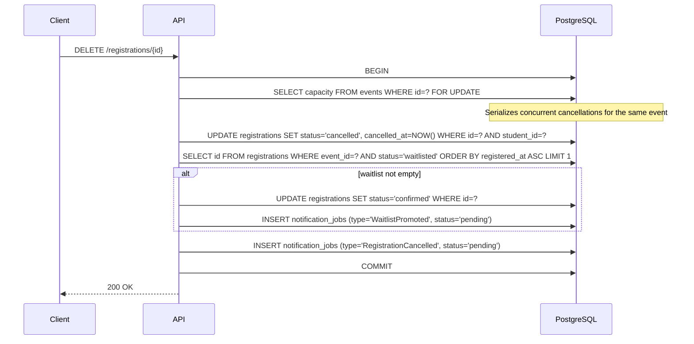
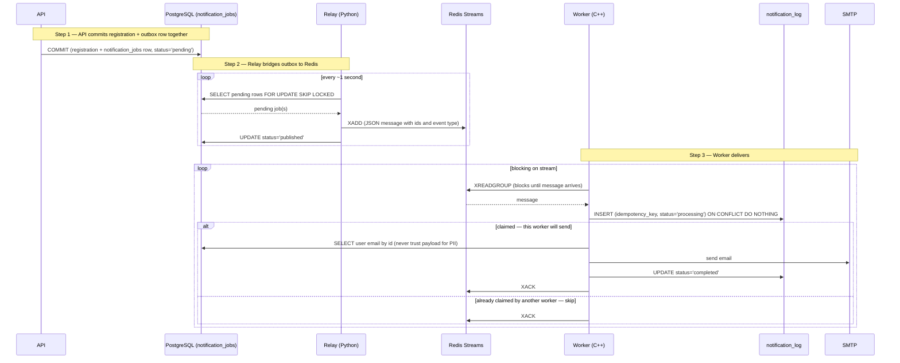
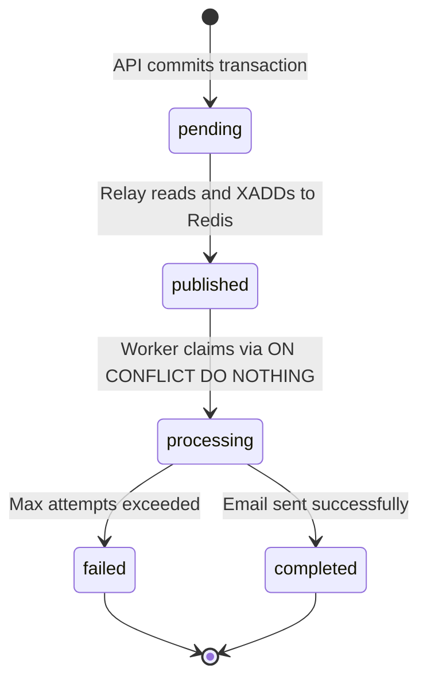
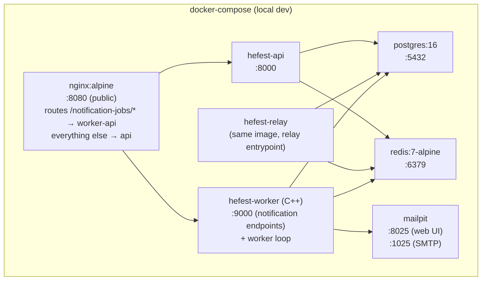

# Backend Architecture Design

**Project:** School Events & Notification Center — AIBEST 2026 Burgas
**Status:** Draft — pending mentor review
**Date:** 2026-06-16
**Backend lead:** TBD
**Stack:** Python 3.12 · FastAPI · Tortoise ORM · PostgreSQL 16 · Redis 7 · C++ (worker)

---

## 1. What we are building

A backend for a school event management system. The system has two user roles: **students**, who browse and register for events, and **organizers**, who create and publish events and manage registrations.

The backend has two core responsibilities:

1. **A REST API** that handles authentication, event management, and registrations — and must return fast, even when a student registers for a fully-booked event and needs to be waitlisted.
2. **An async notification pipeline** that sends emails *after* the API has responded, without blocking the HTTP request. This is the event-driven part of the system.

---

## 2. System topology

The backend runs as **three separate processes** that share one PostgreSQL database and communicate through Redis Streams. Each process has a single, clear responsibility.



| Process | Language | Responsibility |
|---|---|---|
| `api` | Python | Handle HTTP requests, enforce auth/roles, run business transactions |
| `relay` | Python | Bridge: read pending outbox rows → publish to Redis Streams |
| `worker` | C++ | Consume Redis Streams → send email → write delivery log |

The `api` and `relay` live in the same Python repo and share the same Docker image (different entrypoints). The `worker` is a separate C++ repo and Docker image. They are composed together via `docker-compose`.

### Why two repos?

The team has two backend developers with different primary languages (Python and C++). The Redis Streams message format is language-agnostic JSON, making it a clean interface boundary between the two repos. Each developer owns their repo end-to-end.

### Why three processes, not two?

The relay decouples the outbox-polling concern from the email-sending concern. The API writes to Postgres; the relay bridges Postgres to Redis; the worker consumes Redis. Each process can be scaled and replaced independently. This also keeps the C++ worker simple: it only needs to know how to read from Redis and send email — not how to query a polling loop against Postgres.

---

## 3. Technology stack

| Concern | Tool | Reason |
|---|---|---|
| HTTP framework | FastAPI | Async, fast to build, native Pydantic integration |
| ORM | Tortoise ORM | Async-native, fits FastAPI's async model |
| Migrations | Aerich | Native Tortoise migration tool |
| Validation | Pydantic v2 | Request/response schemas, type-safe DTOs |
| Auth | JWT (python-jose + passlib bcrypt) | Stateless, bcrypt for password hashing |
| Database | PostgreSQL 16 | Relational, transactional, supports `FOR UPDATE` and partial indexes |
| Queue | Redis 7 (Streams) | Low-latency async delivery; consumer groups for multi-worker load sharing |
| Worker (C++) | hiredis · libpq · libcurl · nlohmann/json | Redis client, Postgres client, SMTP via libcurl, JSON parsing |
| Dev email | Mailpit | Captures outbound email locally without a real SMTP account |
| Containers | Docker + docker-compose | Single-command local setup |
| Package manager | uv | Fast Python dependency resolution and virtual environment management |
| Type checker | ty | Fast static type checking across the entire Python codebase |
| Linter / formatter | Ruff | Formatting and linting (replaces black, isort, flake8); clang-format for C++ |

---

## 4. Naming conventions

**Hefest** is the codename for this project, used as a consistent prefix across every named artifact — repositories, services, containers, environment variables, and infrastructure resources. This makes it immediately clear what belongs to this project and avoids collisions in shared environments.

| Artifact | Pattern | Examples |
|---|---|---|
| Repositories | `hefest-<role>` | `hefest-api`, `hefest-worker`, `hefest-docs` |
| Docker images | `hefest-<role>` | `hefest-api`, `hefest-worker` |
| Compose services | `hefest-<role>` | `hefest-api`, `hefest-relay`, `hefest-worker`, `hefest-db`, `hefest-redis`, `hefest-mail` |
| Container names | `hefest-<role>` | same as compose service names |
| Database name | `hefest_db` | — |
| Redis stream | `hefest:notifications` | — |
| Redis key prefix | `hefest:` | `hefest:some-key` |
| Environment variables | `HEFEST_<NAME>` | `HEFEST_DB_URL`, `HEFEST_JWT_SECRET` |
| Python package | `hefest` | `from hefest.models import Event` |
| JWT issuer claim | `hefest` | `{"iss": "hefest", ...}` |

The `hefest-docs` repository (this site) follows the same convention and is the central reference for architecture decisions across all `hefest-*` repos.

---

## 5. Repository structure

```
hefest-api/          (Python)
├── app/
│   ├── main.py          — FastAPI application entrypoint
│   ├── config.py        — settings (env vars via pydantic-settings)
│   ├── models/          — Tortoise ORM models
│   ├── schemas/         — Pydantic request/response schemas
│   ├── routers/         — one file per resource (auth, events, registrations, users)
│   ├── services/        — business logic (registration, promotion, outbox)
│   └── worker/
│       └── relay.py     — outbox-to-Redis relay (separate process entrypoint)
├── migrations/          — Aerich migration files
├── tests/
├── Dockerfile
└── docker-compose.yml   — composes api + relay + worker + postgres + redis + mailpit

hefest-worker/       (C++)
├── src/
│   ├── main.cpp         — process entrypoint
│   ├── consumer.cpp/h   — Redis Streams XREADGROUP loop
│   ├── mailer.cpp/h     — SMTP via libcurl
│   ├── db.cpp/h         — libpq for notification_log writes
│   └── message.cpp/h    — JSON parsing (nlohmann/json)
├── CMakeLists.txt
└── Dockerfile
```

!!! note "Schema ownership"
    All database migrations live in `hefest-api`. The C++ worker connects to the same PostgreSQL database but **never runs migrations**. If you add a table or column, run `aerich migrate` in `hefest-api` first, then update the C++ code.

---

## 6. Data model



### Key constraints

```sql
-- One active registration per student per event.
-- 'cancelled' rows are excluded so a student may re-register after cancelling.
CREATE UNIQUE INDEX uq_one_active_registration_per_student
    ON registrations (event_id, student_id)
    WHERE status IN ('confirmed', 'waitlisted');

-- Idempotency: a job type can only be delivered once per registration.
-- Enforced at the DB level as a backstop behind the application check.
ALTER TABLE notification_log
    ADD CONSTRAINT uq_notification_log_key UNIQUE (idempotency_key);
```

### Indexes

```sql
-- Fast published event listing (students)
CREATE INDEX idx_events_published ON events (status) WHERE status = 'published';

-- Fast organizer event lookup
CREATE INDEX idx_events_organizer ON events (organizer_id);

-- Confirmed seat count (used in every registration transaction)
CREATE INDEX idx_registrations_event_status ON registrations (event_id, status);

-- FIFO waitlist ordering for promotion and position queries
CREATE INDEX idx_registrations_waitlist_fifo
    ON registrations (event_id, registered_at)
    WHERE status = 'waitlisted';

-- Student's own registrations (/registrations/me)
CREATE INDEX idx_registrations_student ON registrations (student_id);

-- Relay polling: only scan pending rows, not the full historical table
CREATE INDEX idx_jobs_pending ON notification_jobs (id) WHERE status = 'pending';

-- Stale-job reclaim: find stuck 'processing' rows
CREATE INDEX idx_jobs_processing ON notification_jobs (id) WHERE status = 'processing';
```

---

## 7. Critical transactions

These two transactions are the core of the system's correctness guarantees.

### 6.1 Student registers for an event

The challenge: two students can POST simultaneously. Without serialization, both could read "2 of 3 seats taken" and both get confirmed — creating 4 confirmed rows for a capacity-3 event (overbooking).

The fix: lock the event row at the start of the transaction. Any concurrent registration for the same event blocks at that lock until the first transaction commits.



!!! note "Why lock the event row, not the registrations table?"
    You cannot lock a `COUNT()` — it is a derived value. Locking the single, always-present event row is the standard pattern. The lock is held only for the duration of one count query and one insert (microseconds), so throughput at school-event scale is not affected.

If the unique index fires (student already has an active registration for this event), Postgres raises an error and the transaction rolls back automatically. Return `409 Conflict` to the client.

### 6.2 Student cancels → automatic waitlist promotion

The seat freed by a cancellation must be assigned to the next waitlisted student **in the same transaction**. There must be no moment where the seat appears "free" without an owner.



If the cancelling student was **waitlisted** (not confirmed), no seat is freed and the promotion step is skipped. This is a separate code path with the same transaction structure.

### 6.3 Waitlist position (read-only)

The waitlist position shown to a student in `GET /registrations/me` is computed at read time — no stored integer that can drift under concurrent writes.

```sql
-- For /registrations/me: student is waitlisted across multiple events
SELECT
    r.id,
    r.event_id,
    r.status,
    r.registered_at,
    (
        SELECT COUNT(*) + 1
        FROM registrations r2
        WHERE r2.event_id    = r.event_id
          AND r2.status      = 'waitlisted'
          AND r2.registered_at < r.registered_at  -- how many are ahead of me
    ) AS waitlist_position
FROM registrations r
WHERE r.student_id = $current_user_id
  AND r.status     = 'waitlisted';
```

The `idx_registrations_waitlist_fifo` index covers the inner count query directly.

---

## 8. Async notification pipeline

### 7.1 The dual-write problem

When a registration is saved, two things must happen: record it in the database and enqueue a notification job. If these go to two different systems (e.g., Postgres + RabbitMQ), a process crash between the two writes can lose the event permanently.

**Solution:** the notification job is a row in the *same* Postgres database, inserted in the *same* transaction as the registration. Both writes succeed or both roll back — atomically. This pattern is called the **transactional outbox**.

### 7.2 Full pipeline flow



### 7.3 Job state machine



### 7.4 Domain event types

All three below are mandatory (minimum for full points). The others are implemented as bonus.

| Event type | Trigger | Mandatory |
|---|---|---|
| `RegistrationConfirmed` | Student registered, seat available | Yes |
| `RegistrationWaitlisted` | Student registered, event full | Yes |
| `WaitlistPromoted` | Confirmed registration cancelled, next student promoted | Yes |
| `RegistrationCancelled` | Student cancels own registration | Bonus |
| `EventCancelled` | Organizer cancels event (bulk job per registered user) | Bonus |

Example payload (ids only — worker loads names/emails from DB):

```json
{
    "type": "RegistrationConfirmed",
    "event_id": "550e8400-e29b-41d4-a716-446655440000",
    "user_id": "6ba7b810-9dad-11d1-80b4-00c04fd430c8",
    "registration_id": "6ba7b811-9dad-11d1-80b4-00c04fd430c8",
    "occurred_at": "2026-06-16T14:00:00Z"
}
```

### 7.5 Idempotency strategy

Email delivery is **at-least-once** — the relay may re-publish a message if it crashes between the `XADD` and marking the job `published`. Redis may also redeliver an unacknowledged message via `XAUTOCLAIM`. To prevent duplicate emails:

1. **Claim before sending:** the worker inserts a `notification_log` row with `status='processing'` using `ON CONFLICT DO NOTHING` *before* touching SMTP. Only the worker that successfully inserts proceeds.
2. **If two workers race:** only one insert succeeds; the other sees 0 rows affected and skips.
3. **If a worker crashes after sending but before XACK:** `XAUTOCLAIM` (timeout: 5 minutes) redelivers to another worker, which finds the log row in `completed` or `processing` state and skips. Worst case: a second email is sent — tolerable for a school events system; a missed email is worse.

```sql
-- Worker runs this first, before hitting SMTP
INSERT INTO notification_log (idempotency_key, status, created_at)
VALUES ($registration_id || ':' || $event_type, 'processing', NOW())
ON CONFLICT (idempotency_key) DO NOTHING;
-- If 0 rows affected → skip. If 1 row inserted → proceed to send.
```

---

## 9. REST API surface

All protected routes require `Authorization: Bearer <token>`.

### Authentication

| Method | Path | Role | Description |
|---|---|---|---|
| `POST` | `/register` | Public | Create student account (organizers seeded or created separately — document in README) |
| `POST` | `/login` | Public | Returns JWT |

### Events

| Method | Path | Role | Description |
|---|---|---|---|
| `POST` | `/events` | Organizer | Create event in DRAFT |
| `GET` | `/events` | Both | Students: published only. Organizers: own drafts + published |
| `GET` | `/events/{id}` | Both | Event details + confirmed count + capacity + waitlist size |
| `PUT` | `/events/{id}` | Organizer (owner) | Edit event (only if still in DRAFT) |
| `POST` | `/events/{id}/publish` | Organizer (owner) | DRAFT → PUBLISHED |
| `POST` | `/events/{id}/cancel` | Organizer (owner) | Cancel event; document behavior for existing registrations |

### Registrations

| Method | Path | Role | Description |
|---|---|---|---|
| `POST` | `/events/{id}/registrations` | Student | Register → CONFIRMED or WAITLISTED |
| `DELETE` | `/registrations/{id}` | Student (owner) | Cancel own registration; promotes next waitlisted student |
| `GET` | `/registrations/me` | Student | Own registrations + status + waitlist position |
| `GET` | `/events/{id}/registrations` | Organizer (owner) | Confirmed registrations for own event |
| `GET` | `/events/{id}/waitlist` | Organizer (owner) | Ordered waitlist (FIFO) for own event |

### Notification jobs (optional endpoints — owned by C++ worker service)

| Method | Path | Role | Description |
|---|---|---|---|
| `GET` | `/notification-jobs` | Organizer | List jobs for own events (filter by `event_id`) |
| `GET` | `/notification-jobs/{id}` | Organizer | Single job detail |

### Profile (optional)

| Method | Path | Role | Description |
|---|---|---|---|
| `GET` | `/users/me` | Both | Current user profile |
| `PUT` | `/users/me` | Both | Update display name / email |

### Error shape

All error responses follow a consistent envelope:

```json
{
    "detail": "Human-readable error message",
    "code": "machine_readable_code"
}
```

---

## 10. Rate limiting

Rate limiting protects the API against brute-force attacks and abuse. Redis is already in the stack for the notification pipeline, making it the natural choice — no extra infrastructure required.

### Strategy: sliding window with Redis sorted sets

A sliding window is more accurate than a fixed window. It counts requests within the last *N* seconds relative to *now*, so there is no burst problem at window boundaries.

Each request adds a timestamped entry to a Redis sorted set keyed by endpoint and identifier. Entries older than the window are pruned on every check. The operation is atomic via a Redis pipeline:

```python
import time
import redis

def check_rate_limit(r: redis.Redis, key: str, limit: int, window_seconds: int) -> tuple[bool, int]:
    """Returns (is_limited, retry_after_seconds)."""
    now = time.time()
    window_start = now - window_seconds

    pipe = r.pipeline()
    pipe.zremrangebyscore(key, 0, window_start)   # drop entries outside window
    pipe.zadd(key, {str(now): now})               # record this request
    pipe.zcard(key)                               # count requests in window
    pipe.expire(key, window_seconds)              # auto-cleanup idle keys
    _, _, count, _ = pipe.execute()

    if count > limit:
        oldest = float(r.zrange(key, 0, 0, withscores=True)[0][1])
        retry_after = int(window_seconds - (now - oldest)) + 1
        return True, retry_after

    return False, 0
```

**Redis key pattern:** `hefest:ratelimit:{endpoint_tag}:{identifier}`

Examples:
- `hefest:ratelimit:login:203.0.113.42` — per IP on the login endpoint
- `hefest:ratelimit:register:203.0.113.42` — per IP on registration
- `hefest:ratelimit:event_register:user:6ba7b810-...` — per user on event registration

### Limits per endpoint

| Endpoint | Identifier | Limit | Window | Reason |
|---|---|---|---|---|
| `POST /login` | IP address | 10 requests | 60 s | Brute-force credential guessing |
| `POST /register` | IP address | 5 requests | 3600 s | Account creation spam |
| `POST /events/{id}/registrations` | User ID (from JWT) | 30 requests | 60 s | Registration spam across events |

Global fallback (all routes): 200 requests / 60 s per IP. Catches unclassified abuse without requiring per-endpoint tuning.

### HTTP response

When a limit is exceeded, return `429 Too Many Requests` with a `Retry-After` header so clients can back off gracefully:

```http
HTTP/1.1 429 Too Many Requests
Retry-After: 42
Content-Type: application/json

{
    "detail": "Too many requests. Please retry after 42 seconds.",
    "code": "rate_limit_exceeded"
}
```

### Implementation approach

Rate limiting is implemented as a **FastAPI middleware** so it applies before any route handler runs and cannot be bypassed by individual endpoints. The middleware:

1. Extracts the identifier (IP from `X-Forwarded-For` or `request.client.host`; user ID from the JWT if present and route matches a per-user limit).
2. Runs the Redis pipeline check.
3. Returns `429` immediately if limited; otherwise passes through to the next handler.

!!! note "IP extraction behind nginx"
    In the docker-compose setup, nginx sits in front of the API. Configure nginx to pass `X-Forwarded-For` and trust only the nginx container's IP in FastAPI (`--proxy-headers --forwarded-allow-ips`). Without this, all requests appear to come from the nginx container IP and rate limiting by IP breaks.

---

## 11. Deployment

### Local development (docker-compose)

`docker-compose up` starts all six services. Migrations run automatically on API startup via an entrypoint script.



Services without a public port (`relay`) run as background workers — they produce no HTTP traffic of their own.

### Production path (Helm — appendix)

Production deployment targets Kubernetes via a minimal Helm chart. The same Docker images are used; configuration is injected via `values.yaml` (environment variables). Managed Postgres (e.g., RDS, CloudSQL) and managed Redis (e.g., ElastiCache) replace the in-compose containers.

Scaling levers available by design:
- **API**: stateless — scale horizontally by increasing replica count
- **Worker**: Redis Streams consumer groups distribute messages across multiple worker replicas automatically
- **Relay**: single instance is sufficient (it serializes the outbox); if relay throughput becomes a bottleneck, partition by `event_id` range across multiple relay instances

---

## 12. Scalability notes

The current design was intentionally kept minimal (Postgres outbox + Redis Streams rather than a dedicated message broker like RabbitMQ or Kafka). This is sufficient for school-event scale and keeps the demo simple. The design documents the scaling path without requiring it to be built:

| Concern | Current approach | Scaling path |
|---|---|---|
| Queue throughput | Polling relay (1 s interval) | Add Redis Streams relay → already done |
| Worker parallelism | Single worker process | Redis consumer groups → add worker replicas |
| Read throughput | Postgres with covering indexes | Add read replicas; cache static event metadata (not counts) |
| Registration hotspot | Row-level lock on event | Advisory lock per event_id for even lower contention at scale |
| Notifications | At-least-once SMTP | Add a dedicated transactional email provider (Postmark, SendGrid) |

!!! warning "Do not cache registration counts"
    The confirmed seat count is used in the no-overbooking transaction and must always be read from Postgres under a lock. Caching it would silently break the overbooking guarantee.

---

## 13. Open decisions

These items are not yet finalized and require confirmation before implementation begins.

| # | Decision | Options | Default if not discussed |
|---|---|---|---|
| 1 | Does `ends_at` require a value, or is it nullable for single-datetime events? | Nullable / Required | Nullable |
| 2 | Can a student re-register for an event after cancelling? | Yes (unique index allows it) / No (add hard block) | Yes — allowed |
| 3 | Organizer creation: API endpoint vs seed script? | Seed only / Admin endpoint | Seed script, documented in README |
| 4 | Cancellation rule for students: always allowed, or only before `starts_at`? | Always / Until start | Until `starts_at` |
| 5 | EventCancelled: one bulk job with `event_id`, or one job per registered user? | Bulk / Per-user | Bulk (worker queries affected users) |
| 6 | Health/readiness endpoints (`/health`, `/ready`)? | Implement / Skip | Implement — low effort, strong demo story |

---

*This document reflects decisions made during the initial architecture brainstorming session on 2026-06-16. It is subject to revision based on mentor feedback.*
